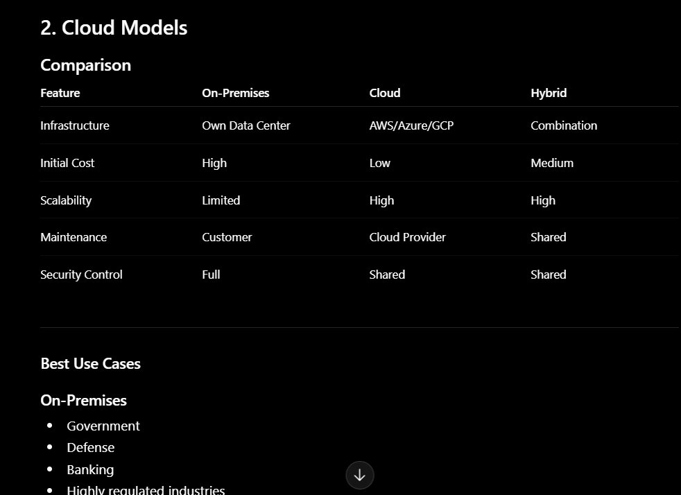

# AWS Pricing Models
Quick Notes

1. Pay-as-you-go

- Pay only for the resources you use.
- No long-term commitment.
- Best for learning, testing, and unpredictable workloads.

- Example:
  Launch an EC2 instance for 5 hours → Pay only for those 5 hours.

2. Reserved Instances (RI)

-
- Commit for 1 or 3 years.
- Up to ~72% cheaper than On-Demand in many cases.
- Best for stable production workloads.

- Example:
  A company running the same database server 24×7.

3. Spot Instances

- Use AWS's unused capacity.
- Can be up to 90% cheaper.
- AWS can terminate them anytime.

**Best for**:

CI/CD jobs
Batch processing
Testing
Big data

# Savings Plans

- Commit to a certain amount of usage.
- Flexible across supported services.
- Often a good option for organizations with predictable spend.

# Cloud Models

33.**Service Models**
1. IaaS

- Infrastructure provided by cloud provider.

- Examples
  
  EC2
  EBS
  VPC

- You manage:
  
  OS
  Applications
  Data
  PaaS

2. PAAS 

- Platform managed by AWS.

- Examples
  
  Lambda
  Elastic Beanstalk
 AWS Fargate

- You manage:
Code
Application

3. SAAS

AWS manages:
  Infrastructure
  OS
  Scaling
  SaaS

- Ready-to-use software.

Examples

  WorkMail
  QuickSight
  Chime

No infrastructure management.

# AWS History
Important Milestones
Year	Milestone
2002	AWS launched
2006	Amazon S3 introduced
2006	Amazon EC2 launched
2014	AWS Lambda introduced (Serverless Computing)
2015+	Global expansion with Regions and Availability Zones
Today	AWS is one of the world's leading cloud platforms
LinkedIn Carousel Idea

Slide 1
AWS Journey

Slide 2
2002

AWS Started

Slide 3

2006

Amazon S3

Cloud Storage Revolution

Slide 4

2006

Amazon EC2

Virtual Servers in Minutes

Slide 5

2014

AWS Lambda

Serverless Computing

Slide 6

Today

200+ Services
Millions of Customers
Global Cloud Infrastructure
Widely used for AI, DevOps, Analytics, and Enterprise Applications

