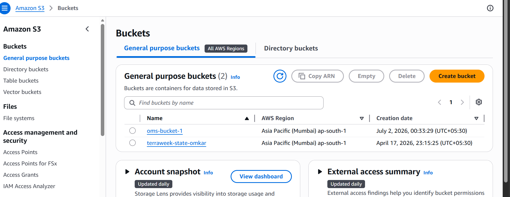
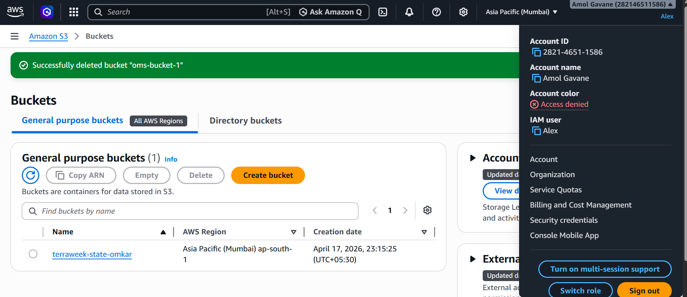

# 🗂️ Day 3 – S3, IAM & AWS CLI

Welcome to **Day 3** of the **7 Days of AWS Challenge** 🚀  
Today, you’ll explore how to store and protect data on AWS, manage user access securely, and perform tasks from the **Command Line Interface (CLI)** like a true Cloud Engineer.

---

## 🧠 Concepts to Learn

### ☁️ What is Amazon S3?
**Amazon Simple Storage Service (Amazon S3)** is a **scalable object storage service** that allows you to store and retrieve data from anywhere on the internet.  
Common use cases include:
- Backup & Restore  
- Hosting Static Websites  
- Data Archiving & Content Delivery  

📘 [S3 Documentation → Click Here](https://docs.aws.amazon.com/s3/?icmpid=docs_homepage_featuredsvcs)

---

### 👤 What is IAM?
**Identity and Access Management (IAM)** is AWS’s service for **controlling access** to resources securely.  
It lets you create users, groups, and roles with defined permissions.

**Key Components:**
- **Users** – Individual accounts  
- **Groups** – Collection of users with common permissions  
- **Roles** – Temporary credentials for apps or services  
- **Policies** – JSON documents defining permissions  

📘 [IAM Documentation → Click Here](https://aws.amazon.com/iam/?gclid=Cj0KCQiA67CrBhC1ARIsACKAa8QO24yZlrPkHNhtrrjI1zqNu85WCpVUCJgiNaYEouhOX5HIRu1QUTsaAroQEALw_wcB&trk=858d3377-dc99-4b71-b7d9-dfbd53b3fb6c&sc_channel=ps&ef_id=Cj0KCQiA67CrBhC1ARIsACKAa8QO24yZlrPkHNhtrrjI1zqNu85WCpVUCJgiNaYEouhOX5HIRu1QUTsaAroQEALw_wcB:G:s&s_kwcid=AL!4422!3!651612429263!p!!g!!amazon%20iam!19836375022!146902912293)

---

### 💻 What is AWS CLI?
**AWS Command Line Interface (CLI)** is a unified tool that lets you manage AWS services from your **terminal** instead of the console.

With CLI, you can:
- Launch EC2 instances  
- Upload data to S3  
- Configure IAM roles and permissions  

📘 [AWS CLI Documentation → Click Here](https://docs.aws.amazon.com/cli/latest/userguide/cli-chap-welcome.html)

---

## 🎯 Tasks for Day 3

### 🪜 Task 1: Secure Your S3 Bucket
- Create a **private S3 bucket** in AWS.
- Modify the **bucket policy** so you can access its contents securely *without making it public*.  
> 💡 This helps you understand how to secure your S3 storage using policies.

## Task 1 Completion:

1. I have created an Private S3 bucket and added object into it and accessed it. 

               AWS Account
                     │
             IAM User / Root User
                     │
             (IAM Permissions)
                     │
                     ▼
        Private S3 Bucket (Not Public)
                     │
        Block Public Access = Enabled

---

### 🪜 Task 2: Configure AWS CLI
- Install and configure the **AWS CLI** on your Ubuntu or local machine using your AWS credentials.

## Task 2 Completion: 

Step 2: Create an IAM User for CLI Access

Do not use the AWS root account for CLI access.

Go to AWS Console → IAM → Users

Create a user (or use an existing IAM user)

Grant the required permissions (for learning, you can use AdministratorAccess; in production, use 
least privilege)

Create an Access Key:

Select the IAM user.

Go to Security credentials.

Under Access keys, click Create access key.

Choose Command Line Interface (CLI).

Download or copy:

Access Key ID

Secret Access Key

⚠️ Save the Secret Access Key immediately. AWS will not show it again.

Step 3: Configure AWS CLI

Run:

aws configure

You'll be prompted for:

AWS Access Key ID [None]:

Paste your Access Key ID.

AWS Secret Access Key [None]:

Paste your Secret Access Key.

Default region name [None]:

Example:

ap-south-1

(Mumbai region)

Default output format [None]:

Enter:

json

Example:

AWS Access Key ID [None]: AKIA****************

AWS Secret Access Key [None]: ********************************

Default region name [None]: ap-south-1

Default output format [None]: json

Step 4: Verify the Configuration

Run:

aws sts get-caller-identity

Expected output:

{
    "UserId": "AIDA************",
    
    "Account": "123456789012",
    
    "Arn": "arn:aws:iam::123456789012:user/YourUser"
}

**This confirms the CLI is configured correctly.**

Step 5: Test the CLI

List your S3 buckets:

aws s3 ls

List EC2 instances:

aws ec2 describe-instances

Get the configured region:

aws configure get region

Where AWS CLI Stores Credentials

On Windows:

C:\Users\<YourUsername>\.aws\

Files:
credentials
config
---

### 🪜 Task 3: Launch EC2 Using CLI
- Create an **EC2 instance using AWS CLI**.  
> 🧩 Resource: [Creating EC2 Using AWS CLI (Blog)](https://madhup.hashnode.dev/creating-an-ec2-instance-on-aws-using-awscli)

---

### 🪜 Task 4: IAM Access Setup for a New Team Member
**Scenario:**  
You’re an IT admin at *GlobalTech Inc.* and a new team member, **Alex**, joins your team.  

You must configure IAM to provide **specific access rights**:  
- View EC2 instances (monitor only).  
- Create S3 buckets (no EC2 modification rights).  

Document your steps and write a short **LinkedIn blog** titled:  
> “Day 3 of #7DaysOfAWS — How I Managed IAM, S3 & CLI on AWS!”

## Task Completion Screenshots: 

- User created as Alex in IAM and Assied below policies 
  1. Ec2ReadOnlyAccess
  2. S3FullAccess

  

   +++
---

## 💬 Engagement Activity

✅ Post your Day 3 learnings on **LinkedIn** with hashtags  
> `#7DaysOfAWS` `#AWSwithTWS`

Mention:
> “Day 3 of my 7 Days of AWS Challenge with @TrainWithShubham 🚀  
> Learned about IAM, S3, and AWS CLI — and how to securely manage access in the cloud!”

You can also:
- Comment on 2 other learners’ posts  
- Share your favorite AWS command  
- Ask a question on [Discord](https://discord.gg/7GjDgDHR49)

Engage → Learn → Grow 🌱

---

## 🧩 Finding It Difficult?

No worries — reach out on:  
- 💬 [LinkedIn](https://www.linkedin.com/in/shubhamlondhe1996/)  
- 💭 [Discord Community](https://discord.gg/7GjDgDHR49)  
- 🌐 [Official Website](https://trainwithshubham.com)

---

## 🌟 Bonus Tip
> Real engineers automate — once you master CLI, you’ll never go back to clicking buttons in the console 😉  
> Try to perform *all future tasks using AWS CLI commands.*

Happy Learning ✨  
**– TrainWithShubham**
